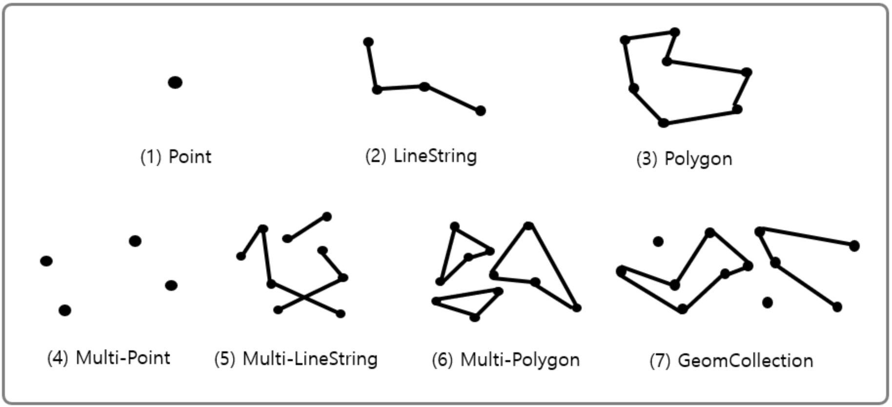
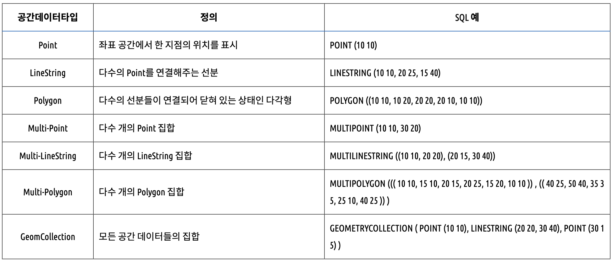

# 8.4 R-Tree 인덱스
- 공간 인덱스는 R-Tree 인덱스 알고리즘을 이용해 2ㅏㅊ원의 데이터를 인덱싱하고 검색하는 목적의 인덱승다.
- R-Tree 인덱스는 2차원의 공간 개념 값이라는 것이다.

- MySQL 공간 확장에는 다음과 같이 크게 세가지 기능이 표함돼 있다.
  - 공간 데이터를 저장할 수 있는 데이터 타입
  - 공간 데이터의 검색을 위한 공간 인덱스(R-Tree 인덱스)
  - 공간 데이터의 연산 함수(거리 또는 포함 관계의 처리)

## 구조 및 특성

- MBR 이란 "Minimum Bounding Rectangle"의 약자로 해당 도형을 감싸는 최소 크기의 사각형을 의미한다.

## R-Tree 인덱스의 용도
- R-Tree 각 도형의 포함 관계를 이용해 만들어진 인덱스다.
- 대표적으로는 '현재 사용자의 위치로부터 반경 5km 이내의 음식점 검색'등과 같은 검색에 사용할 수 있다.
- ST_Contains() 함수와 ST_Within() 함수는 거의 동일한 비교를 수행하지만 두 함수의 파라미터는 반대로 사용해야 한다.
- ST_Contains() 함수는 첫 번째 파라미터로 포함 경계를 가진 도형을 명시하고 두 번째 파라미터로 포함되는 도형을 명시해야 한다.
- 하지만 ST_Within() 함수는 첫 번째 파라미터로 포함되는 도형(또는 점 좌표)을 명시하고 두 번째 파라미터로 포함 경계를 가진 도형을 명시해야 한다.